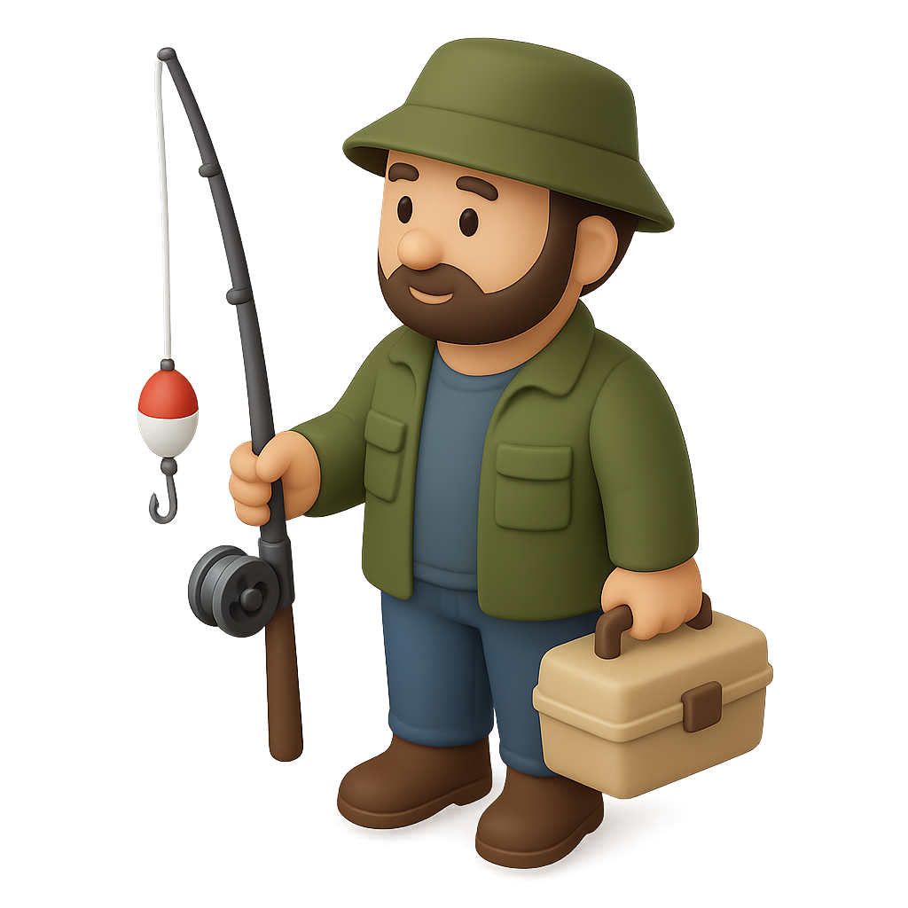

<p align="center">
  
</p>
<h1 align="center">HookLaw</h1>
<p align="center"><strong>Event-driven AI agents with native MCP tools.</strong></p>
<p align="center">Webhooks & RSS feeds in. MCP tools out. AI agent in the middle.</p>

<p align="center">
  
  
  
  
</p>

---

<p align="center">
  <video src="https://github.com/lucianfialho/hooklaw/raw/main/onboarding.mp4" width="700" autoplay loop muted>
    <a href="https://github.com/lucianfialho/hooklaw/raw/main/onboarding.mp4">Watch the onboarding demo</a>
  </video>
</p>

```
  Stripe webhook  ──→  Recipe  ──→  Conta Azul MCP (create invoice)
  GitHub webhook  ──→  Recipe  ──→  Slack MCP (post message)
  HN RSS feed     ──→  Recipe  ──→  Slack MCP (daily digest)
  Any event       ──→  Recipe  ──→  Any MCP server
```

HookLaw connects **any event source** (webhooks, RSS/Atom feeds) to **any MCP server** through AI agents. Define recipes in YAML, bring your own API keys, self-host it.

## Why HookLaw

Other platforms treat webhooks as just another input channel for their AI assistant. HookLaw is **event-first**: every event source gets its own AI agent and MCP tool connections.

- **Proactive, not just reactive** — RSS feeds let your agents monitor the world and act on new information automatically
- **Config-as-code** — one YAML file defines everything, versionable in git
- **Self-hosted** — your data, your keys, your infrastructure
- **Interactive setup** — built-in dashboard with guided onboarding wizard

### MCP done right

| | HookLaw | Others |
|---|---|---|
| **MCP client** | Native, via `@modelcontextprotocol/sdk` | Shell out to CLI tools |
| **Connection** | Persistent pool, reusable | Cold-start per call |
| **Latency** | Sub-second tool calls | ~2.4s overhead per invocation |
| **Transport** | stdio + SSE | stdio only |
| **Management** | Dashboard with health checks & install | Manual config |

### Event Sources

| Source | How it works |
|--------|-------------|
| **Webhooks** | `POST /h/:slug` — receive events from any service |
| **RSS/Atom Feeds** | Poll feeds on interval, deduplicate via content hash |

### Recipes

A recipe connects an event source to MCP tools through an AI agent. Multiple recipes can share the same slug — one Stripe payment triggers invoice creation AND sends a notification.

```
┌─────────────┐     ┌───────────────────────────────────────┐     ┌──────────────┐
│   Sources   │     │            HookLaw                    │     │  MCP Servers  │
│             │     │                                       │     │              │
│  Stripe   ──┼────▶│  Recipe: payment-to-invoice          │────▶│  Stripe MCP  │
│  webhook    │     │    AI agent orchestrates the flow     │────▶│  Conta Azul  │
│             │     │                                       │     │              │
│  GitHub   ──┼────▶│  Recipe: pr-review                   │────▶│  GitHub MCP  │
│  webhook    │     │    AI agent reviews code              │     │              │
│             │     │                                       │     │              │
│  HN RSS   ──┼────▶│  Recipe: hn-digest                   │────▶│  Slack MCP   │
│  feed       │     │    AI agent summarizes & posts        │     │              │
│             │     │                                       │     │              │
│  Any src  ──┼────▶│  Recipe: your-automation             │────▶│  Any MCP     │
└─────────────┘     └───────────────────────────────────────┘     └──────────────┘
```

## Quick Start

```bash
npx hooklaw start
```

No config file? HookLaw launches an **interactive setup wizard** in your browser — pick a provider, choose an event source (webhook or RSS), select integrations, and you're running.

Or install globally:

```bash
npm install -g hooklaw
hooklaw start
```

## Dashboard

HookLaw includes a built-in web dashboard for managing everything:

- **Recipes** — view, edit, and create new automation recipes
- **Executions** — real-time execution logs with payload and agent output
- **MCP Servers** — health checks, tool discovery, install packages, add new servers
- **Feeds** — monitor active RSS/Atom feed pollers
- **Config** — visual YAML config viewer

## Configuration

```yaml
server:
  port: 3007

providers:
  anthropic:
    api_key: ${ANTHROPIC_API_KEY}

# Shared MCP servers — define once, use in any recipe
mcp_servers:
  stripe:
    transport: stdio
    command: npx
    args: ["-y", "@stripe/agent-toolkit", "--tools=all"]
    env:
      STRIPE_SECRET_KEY: ${STRIPE_SECRET_KEY}
  slack:
    transport: stdio
    command: npx
    args: ["-y", "@anthropic/mcp-server-slack"]

# RSS/Atom feed sources
feeds:
  hn-top:
    url: https://hnrss.org/newest?points=100
    slug: hn-digest
    refresh: 300000          # poll every 5 minutes
    skip_initial: true       # don't process existing items on first run
    enabled: true

# Recipes connect events → AI agents → MCP tools
recipes:
  payment-to-invoice:
    description: "Auto-create invoice on Stripe payment"
    slug: stripe-payment              # POST /h/stripe-payment
    mode: async
    agent:
      provider: anthropic
      model: claude-sonnet-4-6
      instructions: |
        When a Stripe payment succeeds, extract customer details
        and create an invoice in Conta Azul.
    tools: [stripe, contaazul]        # MCP servers this recipe uses

  hn-digest:
    description: "Summarize top HN stories and post to Slack"
    slug: hn-digest                   # matches feed slug above
    mode: async
    agent:
      provider: anthropic
      model: claude-sonnet-4-6
      instructions: |
        Summarize this Hacker News story in 2-3 sentences.
        Post to #tech-news on Slack with the title, link, and summary.
    tools: [slack]

logs:
  retention_days: 30
```

Environment variables (`${VAR}`) are substituted from `.env` or the environment.

## How It Works

1. An event arrives — webhook `POST /h/stripe-payment` or a new RSS item
2. HookLaw finds all recipes matching the slug
3. Each recipe runs its AI agent with the event payload
4. Agents use MCP tools to take action (create invoices, send messages, etc.)
5. Everything is logged with full execution history

**Sync mode** — waits for the agent and returns the response in the HTTP reply.
**Async mode** — returns `200 Accepted` immediately, processes in background.

## API

| Method | Path | Description |
|--------|------|-------------|
| `POST` | `/h/:slug` | Receive webhook |
| `GET` | `/health` | Health check |
| `GET` | `/api/recipes` | List all recipes |
| `POST` | `/api/recipes` | Create a recipe |
| `PATCH` | `/api/recipes/:id` | Update a recipe |
| `GET` | `/api/executions` | All executions (filterable) |
| `GET` | `/api/stats` | Execution statistics |
| `GET` | `/api/mcp-servers` | List MCP servers |
| `POST` | `/api/mcp-servers` | Add MCP server |
| `GET` | `/api/mcp-servers/health` | Check all MCP health |
| `GET` | `/api/feeds` | List active feed pollers |
| `GET` | `/api/config` | Redacted config |

## Providers

Bring your own API keys. Supports:

| Provider | Config key | Notes |
|----------|-----------|-------|
| **Anthropic** | `anthropic` | Claude models |
| **OpenAI** | `openai` | GPT models |
| **OpenRouter** | `openrouter` | Multi-model gateway |
| **Ollama** | `ollama` | Local models, set `base_url` |

## MCP Servers

HookLaw works with any MCP server. Popular options:

| Server | Transport | Package |
|--------|-----------|---------|
| Stripe | stdio | `@stripe/agent-toolkit` |
| GitHub | stdio | `@modelcontextprotocol/server-github` |
| Slack | stdio | `@anthropic/mcp-server-slack` |
| Linear | stdio | `mcp-linear` |
| Notion | stdio | `@anthropic/mcp-server-notion` |
| PostgreSQL | stdio | `@modelcontextprotocol/server-postgres` |
| Filesystem | stdio | `@modelcontextprotocol/server-filesystem` |
| Any SSE server | sse | Your URL |

## Architecture

```
hooklaw.config.yaml
        │
        ▼
┌──────────────┐     ┌──────────┐     ┌───────────┐     ┌──────────┐
│  HTTP Server │────▶│  Router  │────▶│   Agent   │────▶│ MCP Pool │
│  /h/:slug    │     │  Recipe  │     │  Tool Loop│     │  stdio   │
│  /api/*      │     │  Matcher │     │  (max 10) │     │  sse     │
│  /dashboard  │     │          │     │           │     │          │
└──────────────┘     └──────────┘     └───────────┘     └──────────┘
        ▲                  │                                   │
        │                  ▼                                   ▼
┌──────────────┐     ┌──────────┐                        ┌──────────┐
│  RSS/Atom    │     │  SQLite  │                        │ External │
│  Feed Poller │     │  (WAL)   │                        │ MCP Svrs │
└──────────────┘     └──────────┘                        └──────────┘
```

**Stack**: TypeScript, Node.js, SQLite (better-sqlite3), Zod, Pino

## Development

```bash
git clone https://github.com/lucianfialho/hooklaw.git
cd hooklaw
pnpm install
pnpm test              # vitest
pnpm run typecheck     # strict TypeScript
pnpm run dev           # start with tsx (hot reload)
```

### Project Structure

```
packages/
├── core/                 # Core engine
│   └── src/
│       ├── types.ts      # Zod schemas (recipes, MCP servers, providers, feeds)
│       ├── config.ts     # YAML loader with ${ENV_VAR} substitution
│       ├── db.ts         # SQLite (executions CRUD)
│       ├── mcp.ts        # MCP client pool (stdio + SSE, persistent connections)
│       ├── agent.ts      # Agentic tool loop (max 10 iterations)
│       ├── feeds.ts      # RSS/Atom feed poller with dedup
│       ├── queue.ts      # Per-recipe async queue with concurrency control
│       ├── router.ts     # Recipe matcher + orchestrator
│       ├── server.ts     # HTTP server (webhook receiver + REST API)
│       ├── setup.ts      # Interactive setup wizard server
│       ├── index.ts      # Bootstrap + wiring
│       └── providers/
│           ├── base.ts       # LLM provider interface
│           ├── anthropic.ts  # Anthropic provider
│           ├── openai.ts     # OpenAI/OpenRouter/Ollama provider
│           └── index.ts      # Provider factory + cache
├── dashboard/            # React SPA (Vite + React Router)
├── cli/                  # CLI (hooklaw start, hooklaw init)
└── hooklaw/              # Published npm package (re-exports core + cli)
```

## License

MIT — self-host it, modify it, do whatever you want.
